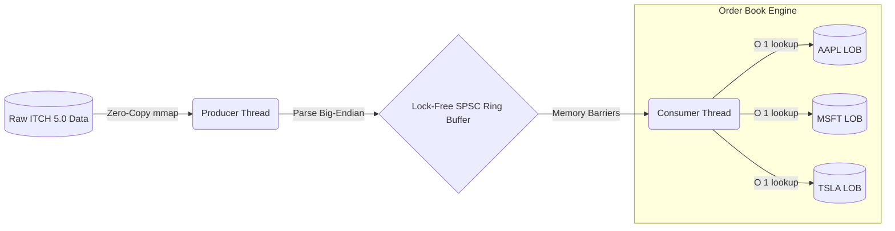

# Binary Market Data Feed Parser & Limit Order Book Engine


A high-performance, ultra-low latency C++17 trading infrastructure project that parses raw binary exchange data (NASDAQ ITCH 5.0) and reconstructs real-time Limit Order Books (LOB). Built from the ground up for maximum throughput, utilizing **Zero-Copy Memory-Mapped I/O**, **Object Pooling**, and **Lock-Free Multi-Threading**.

---

## ⚡ Core Architecture

The architecture is explicitly designed to bypass operating system bottlenecks and eliminate dynamic heap allocations on the hot path.



### 1. Zero-Copy I/O (`mmap`)
Traditional file I/O (`fread`) suffers from system call overhead and kernel-to-user memory copying. This engine maps the ITCH binary file directly into the virtual address space using OS page cache, allowing the CPU to perform zero-copy pointer arithmetic over the data.

### 2. Lock-Free Single-Producer Single-Consumer (SPSC) Queue
To decouple parsing from Order Book construction without lock contention, the threads communicate over a circular ring buffer. It uses `std::atomic<size_t>` with strict `memory_order_release` and `memory_order_acquire` semantics, padded to `alignas(64)` to completely prevent **false sharing** between CPU cores.

### 3. Object Pooling & Arena Allocation
The Limit Order Book reconstructs millions of active orders. Using `new` and `delete` causes severe lock contention in the global heap allocator and fragments the CPU cache. The engine uses a custom `MemoryPool<Order, 4096>` that pre-allocates contiguous memory blocks, turning allocations and deallocations into $O(1)$ free-list pops, eliminating heap fragmentation.

---

## 📊 Performance Benchmarks

The engine can be run in a Single-Threaded baseline or Multi-Threaded SPSC mode. 

**Benchmark: 1,000,000 Message ITCH Dataset (`sample_1m.itch`)**

| Metric | Single-Threaded | Multi-Threaded (SPSC) |
|---|---|---|
| **Total Processed** | 7,498,324 messages | 7,498,324 messages |
| **Elapsed Time** | 1,205.8 ms | 1,080.1 ms |
| **Throughput** | 6.21 Million msgs/sec | **6.94 Million msgs/sec** |
| **Avg Latency** | 160.8 ns / msg | **144.1 ns / msg** |

*Note: The engine tracks and computes the Best Bid, Best Ask, Spread, and Mid Price for all equities instantly after every single message, maintaining strictly sorted Red-Black Trees (`std::map`).*

---

## 🛡️ Memory Safety & Stability

While tools like Valgrind are traditionally used for leak detection, this engine guarantees memory safety **by design**:
1. **RAII Object Lifecycles**: The custom `MemoryPool` owns all chunks. When the `BookManager` falls out of scope, the pool's destructor automatically cascades and returns all block memory to the OS.
2. **Zero Orphaned Orders**: The $O(1)$ order tracking hash-map guarantees that cancellations (`'X'`) and deletions (`'D'`) perfectly track back to the memory pool without leaks.
3. **Deterministic Memory Footprint**: Because the system uses arena allocation, the application's memory usage plateaus and remains perfectly flat, avoiding OOM issues during massive market volume spikes.

---

## 🚀 Usage & CLI Commands

This project is built as a command-line interface (CLI) tool. It requires a C++17 compliant compiler (`g++` or `clang++`).

### 1. Build the Engine
```bash
make clean
make
```

### 2. Run the Parser
The CLI accepts an ITCH binary file and optional execution flags to toggle processing modes:

```bash
# 1. Single-Threaded Baseline (Default)
./build/market_parser data/sample_1m.itch

# 2. Lock-Free Multi-Threaded Mode (Max Throughput)
./build/market_parser data/sample_1m.itch --multi

# 3. Performance Comparison (Runs both & compares)
./build/market_parser data/sample_1m.itch --compare
```

---

## 💼 Use Cases & Applications

While designed as a showcase for high-performance C++ concepts, this infrastructure is directly applicable to real-world quantitative trading:
- **Historical Backtesting**: Rapidly reconstruct full order books from historical exchange data to simulate and test high-frequency trading (HFT) strategies.
- **Latency Benchmarking**: Evaluate OS-level bottlenecks and hardware cache efficiency by profiling single vs. multi-threaded throughput.
- **Market Microstructure Analysis**: Extract tick-level insights, spread dynamics, and order flow imbalances from raw, unaggregated LOB data.

---

## 🧩 Supported ITCH 5.0 Messages

- `A` - Add Order
- `X` - Order Cancel
- `D` - Order Delete
- `E` - Order Executed
- `U` - Order Replace
- `P` - Non-Cross Trade
- `S` - System Event
